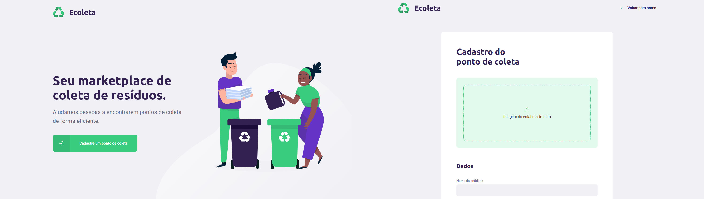
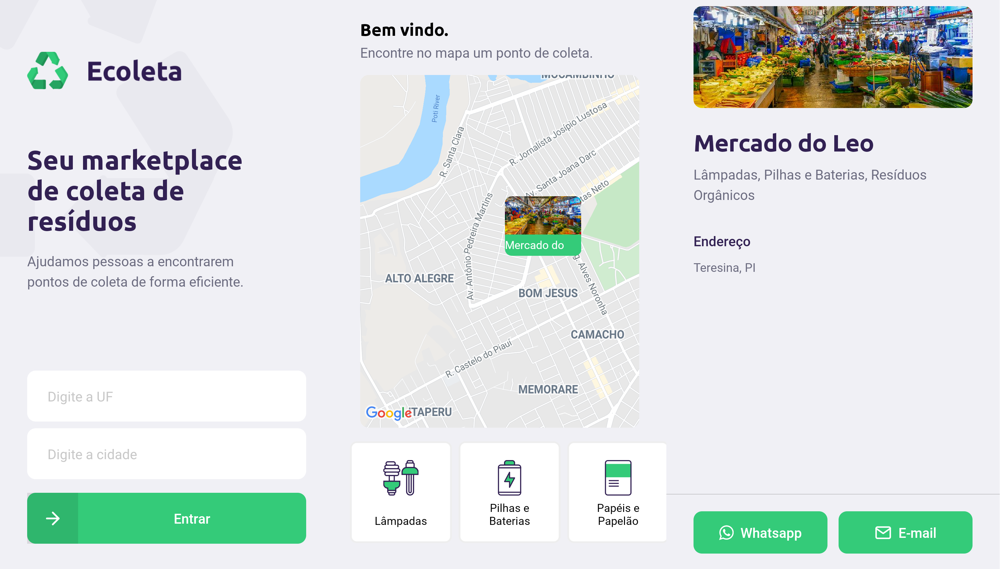

# Next Level Week #01 - Ecoleta

Projeto construído durante o Next Level Week #01 da [Rocketseat]. Trata-se de uma aplicação voltada para o cadastro e busca de pontos de coleta de materiais recicláveis, residuos orgânicos e eletrônicos. 

A aplicação divide-se em: server (API), WEB e Mobile.

Para um correto funcionamento, além das instruções dadas a seguir, deve-se alterar o endereço da URL das imagens (image_url) para os controladores do back-end e o endereço da API (baseURL) em 'src/services/api.ts' para as aplicações Web e Mobile.

## Previews

### Web


### Mobile


## Server

```
# Na pasta server, baixe os pacotes necessários
npm install

# Migrations e Seeds -> criação do banco de dados

npm run knex:migrate
npm run knex:seed

# Inicie a API
npm run dev
```

## Web

```
# Na pasta web, baixe os pacotes necessários
npm install

# inicie a aplicação
npm start
```

## Mobile

```
# Na pasta mobile, baixe os pacotes necessários
npm install

# Inicie a aplicação
expo start
```

# Tecnologias utilizadas

Esse projeto foi desenvolvido com as seguintes tecnologias:

- [Node.js](https://nodejs.org/en/)
- [React](https://reactjs.org)
- [React Native](https://facebook.github.io/react-native/)
- [Expo](https://expo.io/)

[Rocketseat]: https://rocketseat.com.br/
